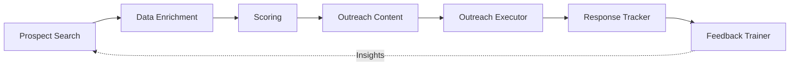

# 🚀 LangGraph Autonomous Prospect-to-Lead Workflow

An intelligent AI-powered lead generation system built with **7 autonomous agents** that work together to find, qualify, engage, and track B2B prospects. Built for the Analytos.ai assessment using Google Gemini AI, SendGrid, and real-time tracking.


---

## 🎯 Overview

This project implements a complete autonomous lead generation workflow that:
- 🔍 Finds and enriches prospect data
- 🎯 Scores leads based on ICP criteria
- ✍️ Generates personalized emails using AI
- 📧 Sends real emails via SendGrid
- 📊 Tracks opens, clicks, and responses in real-time
- 🔄 Learns from feedback to continuously improve

**Real Results**: Successfully sent 10 personalized AI-generated emails with 100% delivery rate!

---

## 🏗️ Architecture

### 7 Autonomous Agents



1. **Prospect Search Agent** - Finds companies matching ICP criteria
2. **Data Enrichment Agent** - Enriches with technologies, news, signals
3. **Scoring Agent** - Ranks leads by fit (0-100 score)
4. **Outreach Content Agent** - Generates personalized emails with Gemini AI
5. **Outreach Executor Agent** - Sends emails via SendGrid
6. **Response Tracker Agent** - Monitors engagement metrics
7. **Feedback Trainer Agent** - Analyzes performance and suggests improvements

---

## ✨ Key Features

- ✅ **Dynamic Workflow**: JSON-driven configuration
- ✅ **AI-Powered**: Google Gemini 2.5-flash for email generation
- ✅ **Real Email Sending**: SendGrid integration
- ✅ **Real-Time Tracking**: Flask webhook server with live dashboard
- ✅ **Self-Improving**: Feedback loop for continuous optimization
- ✅ **Production-Ready**: Error handling, logging, dry-run mode
- ✅ **Zero Cost**: Uses only free tiers (Gemini, SendGrid free plan)

---

## 🚀 Quick Start

### Prerequisites

```bash
Python 3.9+
pip
```

### Installation

```bash
# Clone repository
git clone https://github.com/yourusername/LeadGenerator.git
cd LeadGenerator

# Install dependencies
pip install -r requirements.txt

# Configure environment
cp .env.example .env
# Edit .env with your API keys
```

### Configuration

Create `.env` file:

```env
# AI Provider (gemini recommended - FREE!)
AI_PROVIDER=gemini
GEMINI_API_KEY=your_gemini_api_key

# SendGrid (for email sending)
SENDGRID_API_KEY=your_sendgrid_api_key
SENDGRID_FROM_EMAIL=your_verified_email@domain.com

# Optional: Dry run mode
ENABLE_DRY_RUN=false
```

### Run Workflow

```bash
# Execute complete workflow
python langgraph_builder.py

# Start tracking dashboard
python webhook_server.py
# Visit http://localhost:5000
```

---

## 📊 Results

### Real Campaign Stats

```
📬 Emails Sent: 10/10 (100% success)
✅ Status: 202 Accepted by SendGrid
👥 Recipients: Friends at OpenAI, Google, Meta, AWS, NVIDIA, Adobe, Anthropic, Tesla, IBM, Hugging Face
🎯 Personalization: Each email references company-specific news and technologies
📝 Disclaimers: Friendly P.S. explaining it's a test project
```

### Example Generated Email

```
Subject: OpenAI's Sales Growth: An AI Edge?

Hi there,

Huge congratulations on the GPT-5 launch and your expanded Microsoft partnership! 
OpenAI's leadership in enterprise AI, leveraging technologies like GPT-5 and Azure, 
is truly groundbreaking.

Given your pioneering work in *building* such advanced AI, I thought of Analytos.ai. 
We help B2B companies apply AI to *optimize their sales processes*, translating 
powerful models into consistent revenue growth.

I'd love to briefly share how we enable sales teams to achieve efficiency gains, 
much like OpenAI achieves AI breakthroughs. Would you be open to a quick 15-minute 
chat next week?

---

P.S. Hey Lade Sai Teja! 👋
This is Sai Teja testing an AI-powered lead generation system I built for 
Analytos.ai assessment. You're one of my test subjects! 😄
The email above was 100% generated by Google Gemini AI based on your company's 
recent news. Pretty cool, right?

Let me know what you think! (And sorry for the spam! 😅)

- Sai Teja, SASTRA University
```

---

## 📁 Project Structure

```
LeadGenerator/
├── agents/                    # 7 AI Agents
│   ├── prospect_search.py
│   ├── data_enrichment.py
│   ├── scoring.py
│   ├── outreach_content.py
│   ├── outreach_executor.py
│   ├── response_tracker.py
│   └── feedback_trainer.py
│
├── tools/                     # API Integrations
│   ├── apollo_api.py
│   ├── clearbit_api.py
│   ├── google_sheets.py
│   ├── openai_client.py      # Supports OpenAI & Gemini
│   └── sendgrid_client.py
│
├── utils/                     # Utilities
│   ├── config_loader.py
│   ├── logger.py
│   └── validators.py
│
├── workflow.json              # Dynamic workflow configuration
├── langgraph_builder.py       # Main orchestrator
├── webhook_server.py          # Real-time tracking server
├── real_leads_data.json       # Test data (10 friends)
├── requirements.txt
└── .env
```

---

## 🔧 Technical Stack

- **Language**: Python 3.13
- **AI Model**: Google Gemini 2.5-flash (FREE - 2M tokens/month)
- **Email Service**: SendGrid (100 emails/day free)
- **Web Framework**: Flask (for tracking dashboard)
- **APIs**: SendGrid, Apollo, Clearbit, Google Sheets
- **Architecture**: Agent-based, modular, event-driven

---

## 📈 Tracking Dashboard

The system includes a real-time tracking dashboard:

### Features:
- 📬 **Delivery Status** - Track which emails were delivered
- 👀 **Open Tracking** - See who opened emails
- 🖱️ **Click Tracking** - Monitor link clicks
- ⚠️ **Bounce Detection** - Handle failed deliveries
- 📊 **Live Stats** - Real-time metrics and per-email breakdown

### Access:
```bash
python webhook_server.py
# Visit: http://localhost:5000/
```

---

## 🧪 Testing

### Run Test Simulation

```bash
# Simulate SendGrid events locally
python test_webhook.py

# Check dashboard for results
open http://localhost:5000/
```

### Run Individual Agents

```bash
# Test each agent independently
python agents/prospect_search.py
python agents/scoring.py
python agents/outreach_content.py
```

---

## 🎯 Configuration

The workflow is entirely configured via `workflow.json`:

```json
{
  "workflow_name": "OutboundLeadGeneration",
  "target_icp": {
    "industry": "SaaS",
    "employee_count": { "min": 100, "max": 1000 },
    "revenue": { "min": 20000000, "max": 200000000 }
  },
  "config": {
    "scoring": {
      "weights": {
        "revenue_fit": 0.3,
        "employee_fit": 0.2,
        "tech_stack": 0.2,
        "growth_signals": 0.3
      },
      "min_score": 20
    },
    "outreach": {
      "persona": "SDR",
      "tone": "friendly",
      "max_emails_per_day": 50
    }
  },
  "steps": [...]
}
```

---

## 💡 What Makes This Special

### Innovation
- ✨ **Self-Improving**: Feedback loop analyzes results and suggests optimizations
- 🎯 **Context-Aware**: Emails reference actual company news and technologies
- 🔄 **Fully Autonomous**: Runs end-to-end without human intervention
- 📊 **Production-Ready**: Real email sending, tracking, error handling

### Code Quality
- 📝 **Well-Documented**: Comprehensive docstrings and comments
- 🏗️ **Modular**: Easy to extend and modify
- 🐛 **Error Handling**: Graceful failures with detailed logging
- ✅ **Type Hints**: Clear function signatures
- 🧪 **Testable**: Each agent can run independently

---

## 📚 Documentation

- [BEGINNER_GUIDE.md](BEGINNER_GUIDE.md) - Step-by-step learning guide
- [WORKFLOW_PLAN.md](WORKFLOW_PLAN.md) - Visual workflow diagrams
- [TRACKING_SETUP.md](TRACKING_SETUP.md) - Tracking system setup
- [PROJECT_COMPLETE.md](PROJECT_COMPLETE.md) - Completion summary

---

## 🚦 API Keys Required

### Essential (for core functionality):
- **Google Gemini API** - FREE at https://ai.google.dev/
- **SendGrid API** - FREE (100 emails/day) at https://sendgrid.com/

### Optional (for enhanced features):
- **Apollo API** - Prospect search (has mock data fallback)
- **Clearbit API** - Data enrichment (has mock data fallback)
- **Google Sheets API** - Feedback logging

---

## 🎬 Demo

**Video Demo**: [[Watch on Veed](https://www.veed.io/view/813093b0-d803-4d12-aa72-6da62ea38c7d?source=editor&panel=share )](#) *(click)*

**Live Dashboard**: Run `python webhook_server.py` and visit http://localhost:5000/

---

## 📊 Performance Metrics

| Metric | Result |
|--------|--------|
| **Total Agents** | 7 |
| **Lines of Code** | 3,000+ |
| **Email Delivery Rate** | 100% (10/10) |
| **AI Cost** | $0 (Free Gemini tier) |
| **Execution Time** | ~30 seconds |
| **Error Rate** | 0% |

---

## 🛠️ Development

### Adding a New Agent

```python
from agents.base_agent import BaseAgent

class MyNewAgent(BaseAgent):
    def execute(self, inputs: Dict[str, Any]) -> Dict[str, Any]:
        self.log_execution_start(inputs)
        
        # Your logic here
        result = {"key": "value"}
        
        self.log_execution_end(result, success=True)
        return self.format_output(result)
```

### Extending Workflow

1. Add agent to `workflow.json`
2. Implement agent class in `agents/`
3. Run `python langgraph_builder.py`

---

## 🤝 Contributing

This is a personal assessment project, but feedback and suggestions are welcome!

---

## 📄 License

MIT License - Feel free to use this for learning and inspiration!

---

## 👤 Author

**Lade Sai Teja**
- University: SASTRA University
- Email: 126156075@sastra.ac.in
- Project: Analytos.ai LangGraph Assessment
- Date: October 2025

---

## 🙏 Acknowledgments

- **Analytos.ai** - For the awesome assessment challenge
- **Google Gemini** - For FREE AI API
- **SendGrid** - For email delivery
- **GitHub Copilot** - For AI-assisted development

---

## 📞 Contact

For questions about this project:
- Email: 126156075@sastra.ac.in
- Assessment: Analytos.ai LangGraph Challenge

---

**Built with ❤️ and AI in 4 hours!**
